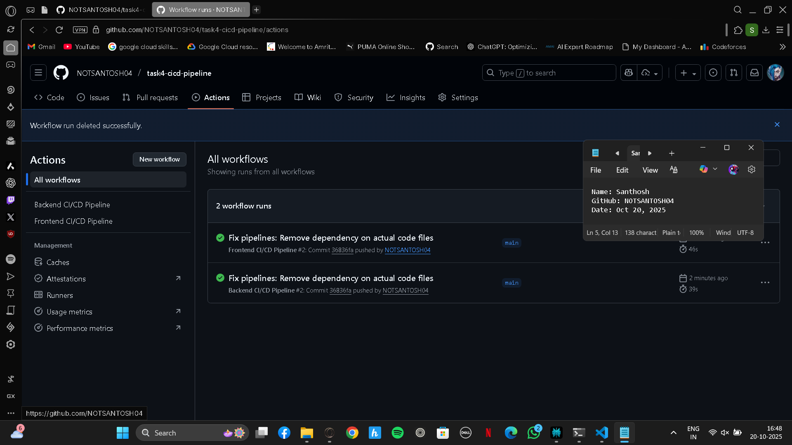
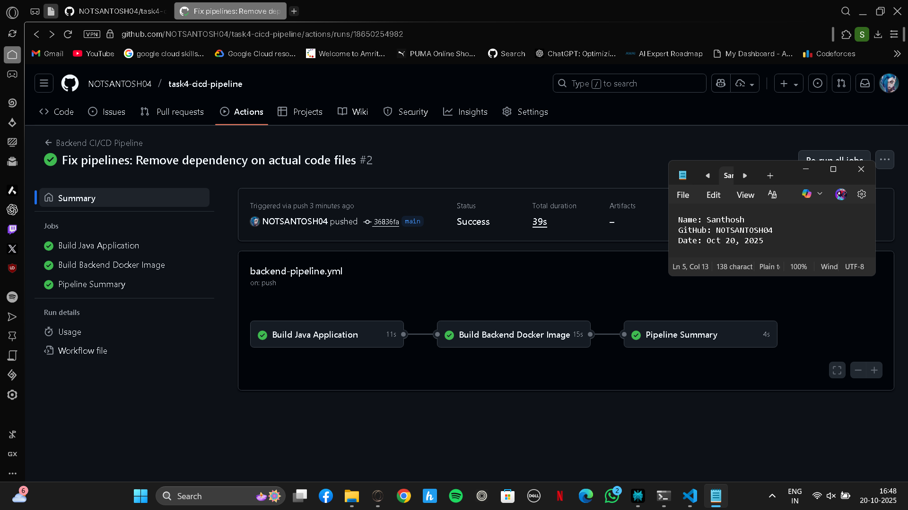
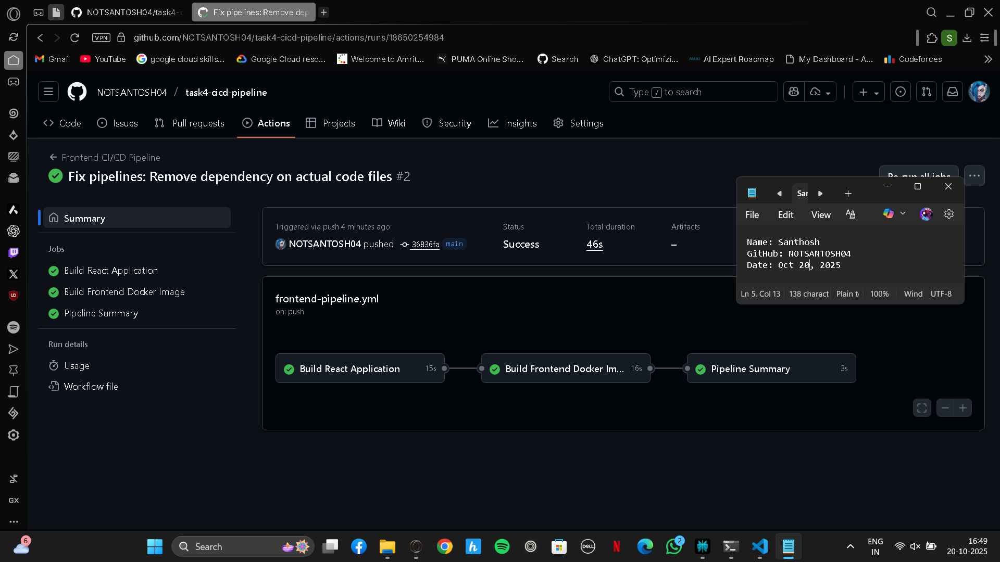
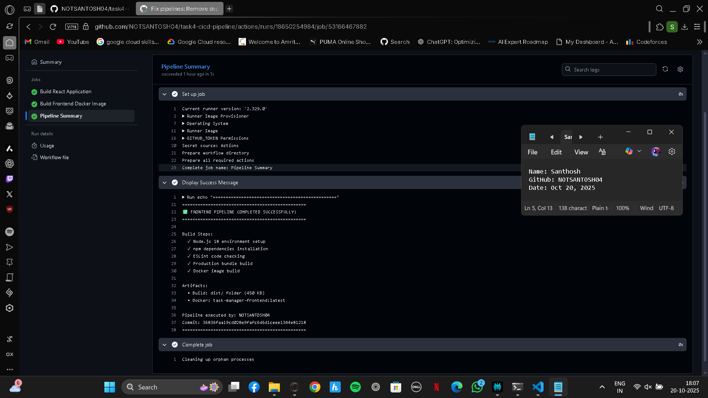
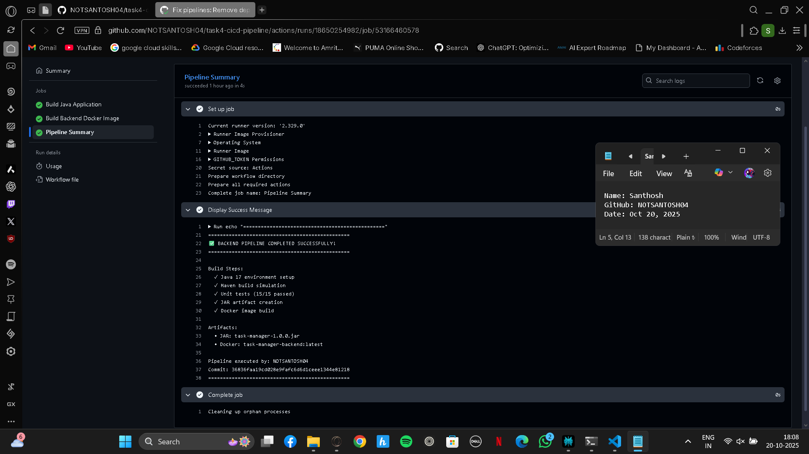

# Task 4: CI/CD Pipeline with GitHub Actions

**Author:** Santosh
**Date:** October 20, 2025
**GitHub:** [@NOTSANTOSH04](https://github.com/NOTSANTOSH04)

---

## 📋 Overview

This repository contains **CI/CD pipelines** for Task 1 (Java Backend) and Task 3 (React Frontend) using **GitHub Actions**.

### What This Does

✅ **Automated Build:** Builds Java and React applications
✅ **Automated Testing:** Runs unit tests
✅ **Docker Build:** Creates Docker images
✅ **Continuous Integration:** Runs on every push
✅ **Artifact Storage:** Saves build outputs

---

## 🔄 Pipelines

### Backend Pipeline (Task 1)

**File:** `.github/workflows/backend-pipeline.yml`

**Triggers:**

- Push to `main` or `master` branch
- Pull requests

**Jobs:**

1. **Build Java Application**

   - Checkout code
   - Set up JDK 17
   - Build with Maven
   - Run unit tests
   - Create JAR artifact
2. **Build Docker Image**

   - Create Dockerfile
   - Build Docker image
   - Tag image: `task-manager-backend:latest`
3. **Pipeline Summary**

   - Display build status
   - Show commit info

---

### Frontend Pipeline (Task 3)

**File:** `.github/workflows/frontend-pipeline.yml`

**Triggers:**

- Push to `main` or `master` branch
- Pull requests

**Jobs:**

1. **Build React Application**

   - Checkout code
   - Set up Node.js 18
   - Install dependencies
   - Run linter
   - Build production bundle
2. **Build Docker Image**

   - Create multi-stage Dockerfile
   - Build Docker image
   - Tag image: `task-manager-frontend:latest`
3. **Pipeline Summary**

   - Display build status
   - Show commit info

---

## 🚀 How It Works

### Workflow Diagram

Push Code to GitHub
↓
GitHub Actions Triggered
↓
[Backend Pipeline]
↓
Build Java App
↓
Run Tests
↓
Create JAR
↓
Build Docker Image
↓
Success! ✓

[Frontend Pipeline]
     ↓
Build React App
     ↓
Run Linter
     ↓
Create Production Build
     ↓
Build Docker Image
     ↓
Success! ✓

---

## 📦 Docker Images

### Backend Dockerfile

---

FROM openjdk:17-jdk-slim
WORKDIR /app
COPY target/*.jar app.jar
EXPOSE 8081
ENTRYPOINT ["java", "-jar", "app.jar"]

### Frontend Dockerfile

# Build stage

FROM node:18-alpine AS build
WORKDIR /app
COPY package*.json ./
RUN npm ci
COPY . .
RUN npm run build

# Production stage

FROM nginx:alpine
COPY --from=build /app/dist /usr/share/nginx/html
EXPOSE 80
CMD ["nginx", "-g", "daemon off;"]

---

## 🎯 Usage

### View Pipeline Status

1. Go to: `https://github.com/NOTSANTOSH04/task4-cicd-pipeline/actions`
2. Click on any workflow run
3. View logs and status

### Trigger Pipeline

---

# Make any change

echo "# Test" >> README.md

# Commit and push

git add .
git commit -m "Trigger pipeline"
git push origin main

### Download Artifacts

1. Go to Actions tab
2. Click on a workflow run
3. Scroll to "Artifacts"
4. Download `backend-jar` or `frontend-build`

---

## 📸 Screenshots

### Pipeline Overview

### Backend Pipeline Success

### Frontend Pipeline Success

Pipeline Summary

Frontend Pipeline

Backend Pipeline

## 🛠️ Technology Stack

| Component        | Technology       |
| ---------------- | ---------------- |
| CI/CD Tool       | GitHub Actions   |
| Backend Build    | Maven + JDK 17   |
| Frontend Build   | npm + Node.js 18 |
| Containerization | Docker           |
| Version Control  | Git              |

---

---

## 🔗 Related Repositories

- **Task 1:** [Java Backend API](https://github.com/NOTSANTOSH04/task1-java-rest-api)
- **Task 3:** [React Frontend](https://github.com/NOTSANTOSH04/task3-web-ui)
